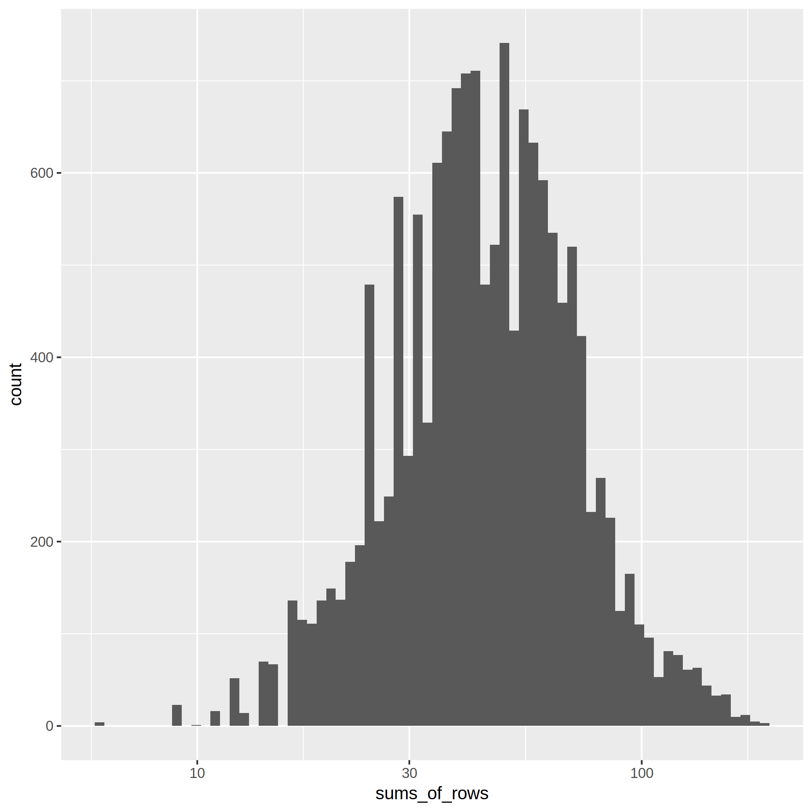
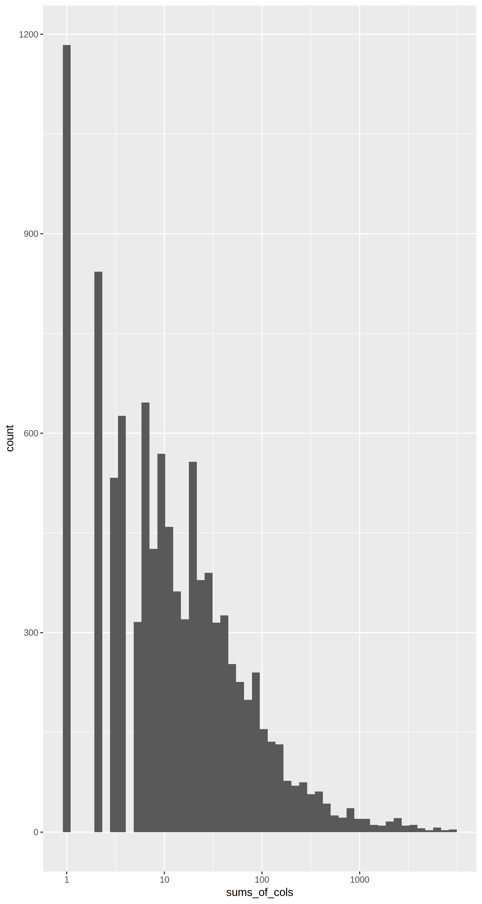

## Statistics

* Number of theorems/premises:  4564
* Number of different features of theorems/premises: 10241
* Average number of features per theorem: 26.92
* Number of pairs (theorem, premise): 15175
* Average number of features per pair (theorem, premise): 49.09
* Average number of pairs (theorem, premise) per feature: 36.37

* Histogram of sums of rows in the feature matrix:

* Histogram of sums of columns in the feature matrix:

