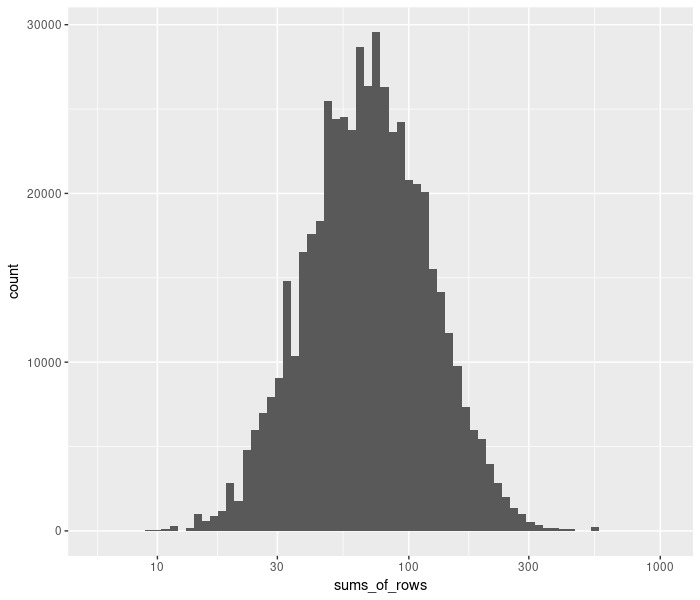
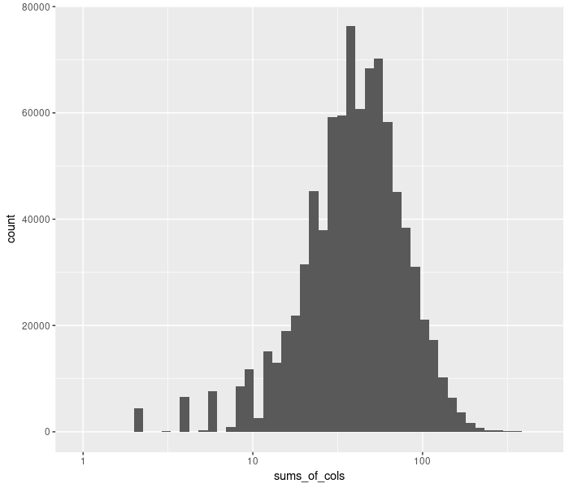

## Statistics

* Number of theorems/premises:  146700
* Number of different features of theorems/premises: 451706
* Average number of features per theorem: 41.38
* Average number of features per pair (theorem, premise): 80.25
* Average number of pairs per feature: 46.59

* Histogram of sums of rows in the feature matrix:

* Histogram of sums of columns in the feature matrix:

